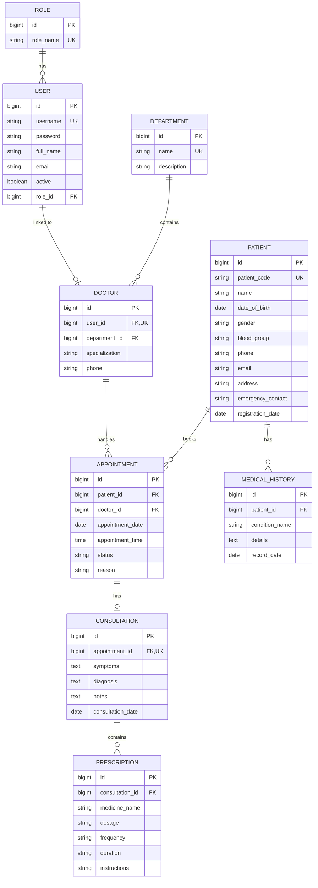

# MedSphere – Entity Relationship Diagram

## 1. Purpose

This document describes the database entities and relationships implemented in the current **Semester 3 Mini Version** of MedSphere.

The diagram below is based on the actual JPA entities in the project. It intentionally represents the current implementation rather than adding fields or modules that are outside the project scope.

## 2. ER Diagram

## 3. Entity Description

### Role

Stores the application's security roles.

Current role values:

- `ADMIN`
- `RECEPTIONIST`
- `DOCTOR`

`role_name` is unique.

### User

Stores login and account information.

Important fields:

- Username
- BCrypt-hashed password
- Full name
- Email
- Active status
- Role reference

A User belongs to one Role.

### Department

Stores hospital departments.

Important fields:

- Department name
- Description

A Department can contain multiple Doctor profiles.

### Doctor

Stores professional doctor information and links it to a User account.

Important fields:

- User account
- Department
- Specialization
- Phone

The `user_id` relationship is unique, so one User account can be linked to at most one Doctor profile.

### Patient

Stores patient registration and contact information.

Important fields:

- Patient code
- Name
- Date of birth
- Gender
- Blood group
- Phone
- Email
- Address
- Emergency contact
- Registration date

The patient code is unique and follows the application's generated registration-code convention.

### Appointment

Connects a Patient and a Doctor for a scheduled visit.

Important fields:

- Patient reference
- Doctor reference
- Appointment date
- Appointment time
- Status
- Reason

Current status values are:

- `SCHEDULED`
- `COMPLETED`
- `CANCELLED`

### Consultation

Stores the clinical consultation associated with an appointment.

Important fields:

- Appointment
- Symptoms
- Diagnosis
- Notes
- Consultation date

The appointment relationship is unique, making the current model one consultation per appointment.

### Prescription

Stores medicines prescribed during a consultation.

Important fields:

- Consultation
- Medicine name
- Dosage
- Frequency
- Duration
- Instructions

One consultation can contain multiple prescription records.

### MedicalHistory

Stores a patient's basic historical medical records.

Important fields:

- Patient
- Condition name
- Details
- Record date

One patient can have multiple medical history records.

## 4. Relationship Summary

| Relationship | Cardinality | Meaning |
| --- | --- | --- |
| Role → User | 1 : Many | One role can be assigned to many users |
| User → Doctor | 1 : 0..1 | A user account can have zero or one doctor profile |
| Department → Doctor | 1 : Many | One department can contain many doctors |
| Patient → Appointment | 1 : Many | A patient can have many appointments |
| Doctor → Appointment | 1 : Many | A doctor can handle many appointments |
| Appointment → Consultation | 1 : 0..1 | An appointment may have one consultation |
| Consultation → Prescription | 1 : Many | A consultation can have multiple prescriptions |
| Patient → MedicalHistory | 1 : Many | A patient can have multiple medical history records |

## 5. Database Design Notes

- Primary keys use generated `Long` identifiers.
- Foreign keys are represented through JPA relationships.
- Usernames, role names, department names, patient codes, and doctor-user links have uniqueness constraints where required by the implementation.
- Required relationships use non-null foreign keys.
- The current schema is maintained locally using Hibernate/JPA with `spring.jpa.hibernate.ddl-auto=update`.

## 6. Scope Note

The ER diagram represents the current Semester 3 mini version. It does **not** add billing, pharmacy inventory, laboratory, wards, bed management, notifications, or other future-scope modules that are not currently implemented.
